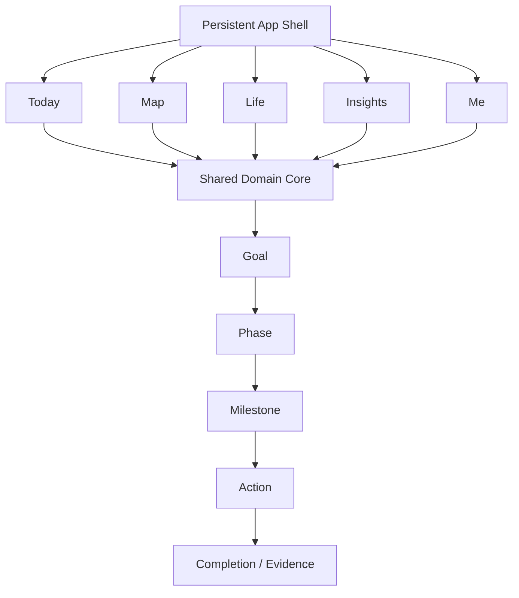
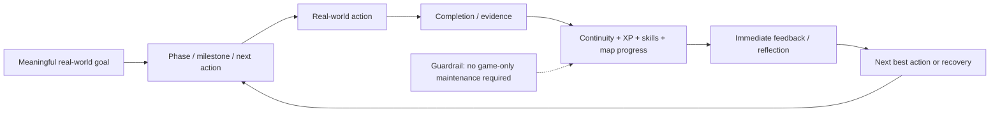

# LEGACY Gamification, UX and Product Architecture State-of-the-Art

> **Agent contract:** Treat this file as a cross-cutting reference artifact. It is a **baseline candidate**, not implementation truth. Before proposing a new screen, navigation pattern, gamification mechanic, shared domain entity, use case, requirement, or architecture decision, check the relevant sections here and preserve existing IDs/traceability. If a proposal intentionally conflicts with a stated design principle or P0 requirement, surface the conflict explicitly and propose an ADR/deviation instead of silently overriding it.

## How agents should consume this artifact

- **Mockup / UI agents:** read Sections 5-7, 9.3, 10-13, and the UX invariants below before drawing or implementing screens.
- **Design-system agents:** read Sections 5-8 and 9.3-9.4; prefer existing interaction grammar and reusable primitives over per-module patterns.
- **Architecture agents:** read Sections 1, 5-9, 12-15; keep the shared domain model and multi-user/privacy constraints cross-cutting.
- **Requirements agents:** use Section 9 IDs as stable candidates and extend them rather than renumbering them.
- **Verification agents:** derive tests from Section 11 and the Verification column in Section 9; preserve requirement -> use case -> FVT traceability.

### UX invariants for mockup development

1. The default compact shell is **Today / Map / Life / Insights / Me** unless superseded by an approved architecture decision.
2. Gamification must reinforce meaningful actions; no game-only maintenance may be required to preserve core progress.
3. Rich thematic/pixel-art presentation belongs primarily to progression surfaces such as **Map** and selected **Me/reward** moments; high-frequency operational screens remain restrained and legible.
4. Each high-frequency screen exposes one clearly dominant primary action and explicit loading, empty, populated, error, disabled, and permission-denied states where applicable.
5. Top-level navigation is navigation, not an action bar.
6. Critical interactions must not depend on drag, color alone, or animation; accessibility and reduced-motion alternatives are first-class requirements.
7. A missed day must trigger recovery/replanning semantics rather than destructive reset semantics.
8. Social/competition mechanics are opt-in; private/cooperative behavior is the default.
9. New modules reuse the shared domain grammar and shell rather than becoming isolated mini-apps.
10. Any AI-generated feature or requirement remains a proposal until explicit human approval.
# 1. Executive Summary

The strongest products in this space do not rely on gamification alone. They combine a low-friction tracking loop with clear feedback, durable progress, optional rewards, and an interface that keeps the real-world objective more important than the game layer. Habitica demonstrates deep RPG mechanics; Finch demonstrates gentle companion-based motivation; Fabulous demonstrates guided routines and journeys; Streaks and Loop demonstrate low-friction consistency tracking; Habitify demonstrates integration and analytics; LifeUp demonstrates customizable progression systems; Forest demonstrates a tangible visual artifact tied to focus; Duolingo and Apple Activity provide mature reference patterns for streaks, quests, rings, awards, and glanceable feedback. [R1-R10]

The research evidence supports using gamification as an engagement aid, but not as a substitute for good behavior-change design. A 2024 systematic review of 36 randomized trials found only modest improvements from gamified health apps versus non-gamified comparators, while field research also shows that game mechanics can improve behavior without necessarily increasing intrinsic motivation. Competition can additionally increase stress for some users. [R11-R13]

For LEGACY, the resulting design thesis is: productivity first, game second. The app should minimize manual bookkeeping, derive game state from meaningful actions, preserve progress after occasional misses, keep competition optional, and let users choose how visible the game layer is. The visual goal map can be expressive and thematic, while the operational screens should remain calm, predictable, and fast.

Because LEGACY is a multi-domain "app of apps," the primary UX risk is navigation and cognitive overload. The recommended shell uses five or fewer top-level destinations on compact screens, preserves per-section navigation state, adapts to a sidebar on larger screens, and uses progressive disclosure for advanced functions. This aligns with current Apple HIG guidance and WCAG 2.2 accessibility requirements. [R14-R18]

| **Recommended product principle:** Every interaction that increases XP, unlocks a map node, or grants a reward should correspond to a meaningful user action or verified data signal. Avoid "game chores" that exist only to feed the gamification system. |
|------------------------------------------------------------------------------------------------------------------------------------------------------------------------------------------------------------------------------------------------------------|

## 1.1 Proposed top-level product structure

- Today - daily agenda, habits, tasks, calendar context, and the next best action.

- Map - long-, mid-, and short-term goal progression represented as themed phases/islands.

- Life - module launcher for Personal, Work, Health, Finance, Learning, and future domains.

- Insights - consistency, trends, reviews, forecasts, and cross-domain analytics.

- Me - XP, skill progression, rewards, achievements, family/workspace management, and settings.

# 2. Scope and Research Method

This study combines three evidence layers:

1.  Current product documentation and feature pages from representative habit, productivity, self-care, focus, learning, and platform-level gamification products.

2.  Peer-reviewed research on gamification and behavior change, with emphasis on systematic reviews and controlled field studies.

3.  Qualitative community signals from recent user discussions. These are treated as anecdotal design input, not as representative survey data.

| **Scope boundary:** This is a product and UX state-of-the-art study, not a clinical efficacy review. Health-related design claims are limited to general behavior-support patterns; LEGACY should avoid presenting wellness mechanics as medical advice. |
|----------------------------------------------------------------------------------------------------------------------------------------------------------------------------------------------------------------------------------------------------------|

# 3. State of the Art - Product Landscape

| **Platform**       | **Archetype**                   | **Key mechanics**                                                                                                             | **Pattern worth borrowing**                                                | **Risk / anti-pattern**                                                                         | **Src** |
|--------------------|---------------------------------|-------------------------------------------------------------------------------------------------------------------------------|----------------------------------------------------------------------------|-------------------------------------------------------------------------------------------------|---------|
| Habitica           | RPG task manager                | Habits, dailies, to-dos, XP, gold, gear, party quests, challenges, social accountability.                                     | Deep game loop tied directly to task completion.                           | High setup/maintenance risk; fantasy theme and game systems can dominate the productivity task. | R1      |
| Finch              | Self-care companion             | Daily goals, pet energy/adventures, reflections, focus/breathing, quests, shops, friends, self-care areas.                    | Gentle emotional attachment and small-win loop.                            | Reward/cosmetic layer can become the focus for some users.                                      | R2      |
| Fabulous           | Behavioral routine coach        | Morning/afternoon/evening routines, guided journeys, challenges, coaching, circles, guided activities.                        | Strong staged onboarding and habit stacking.                               | Content-heavy coaching can feel prescriptive if not personalized.                               | R3      |
| Streaks            | Minimal habit tracker           | Up to 24 tasks, flexible schedules, streaks, Apple Health automation, statistics, widgets/watch support.                      | Low-friction, glanceable, platform-native execution.                       | Hard streak framing can create all-or-nothing pressure if not softened.                         | R4      |
| Loop Habit Tracker | Minimal + resilient tracking    | Habit strength score, flexible schedules, reminders, detailed charts, widgets, offline/local-first privacy.                   | Progress degrades gradually instead of collapsing after one miss.          | Less narrative motivation and limited social/game depth.                                        | R5      |
| Habitify           | Data-driven tracker             | Journal, flexible schedules, reminders, Health/Fit sync, calendar/screen-time links, API/automation, circles/challenges.      | Automation and integration reduce manual logging.                          | Power features can raise configuration complexity.                                              | R6      |
| LifeUp             | Customizable life RPG           | EXP, attributes/skills, coins, rewards shop, achievements, loot/crafting, task/habit tracking.                                | Highly customizable economy; supports user-defined progression.            | Power-user complexity and economy balancing burden.                                             | R7      |
| Forest             | Gamified focus                  | Focus timer grows trees, distraction consequences, forest history, challenges, social planting, analytics, real-tree linkage. | Turns abstract focus time into a persistent visual artifact.               | Punitive "tree dies" mechanic may not fit every context.                                        | R8      |
| Duolingo           | Learning gamification reference | XP, streaks, quests, leagues/leaderboards, milestone rewards; competition can be disabled.                                    | Mature loop of short sessions, visible progress, and recurring challenges. | Optimization for points can compete with intrinsic learning goals.                              | R9      |
| Apple Activity     | Ambient activity gamification   | Three rings, coaching, awards, complications/widgets, automatic sensor measurement.                                           | Continuous, glanceable feedback with minimal data-entry friction.          | Best when inputs are automatically measurable; less applicable to subjective goals.             | R10     |

## 3.1 Cross-product pattern matrix

| **Platform**   | **Low-friction** | **Streak / continuity** | **XP / levels** | **Currency / rewards** | **Narrative / map** | **Social** | **Analytics** | **Auto capture** |
|----------------|------------------|-------------------------|-----------------|------------------------|---------------------|------------|---------------|------------------|
| Habitica       | ◐                | ●                       | ●               | ●                      | ◐                   | ●          | ◐             | -                |
| Finch          | ●                | ●                       | ◐               | ●                      | ●                   | ●          | ◐             | ◐                |
| Fabulous       | ◐                | ●                       | -               | ◐                      | ●                   | ◐          | ◐             | -                |
| Streaks        | ●                | ●                       | -               | -                      | -                   | -          | ●             | ●                |
| Loop           | ●                | ●\*                     | -               | -                      | -                   | -          | ●             | ◐                |
| Habitify       | ●                | ●                       | -               | ◐                      | -                   | ◐          | ●             | ●                |
| LifeUp         | ◐                | ●                       | ●               | ●                      | ◐                   | ◐          | ●             | ◐                |
| Forest         | ●                | ●                       | ◐               | ●                      | ●                   | ●          | ●             | ●                |
| Duolingo       | ●                | ●                       | ●               | ●                      | ●                   | ●\*        | ●             | ●                |
| Apple Activity | ●                | ●                       | -               | ●                      | -                   | ●          | ●             | ●                |

Legend: ● = strong/first-class pattern; ◐ = partial or secondary; - = not a defining pattern. \*Loop uses a durable habit-strength concept rather than a pure all-or-nothing streak; Duolingo social competition can be disabled. The matrix is a design comparison, not a product score.

# 4. What Appears to Work - and What Users Reject

## 4.1 Evidence-backed observations

| **Observation**                                                       | **Evidence**                                                                                                                                                                        | **Design consequence for LEGACY**                                            | **Src** |
|-----------------------------------------------------------------------|-------------------------------------------------------------------------------------------------------------------------------------------------------------------------------------|------------------------------------------------------------------------------|---------|
| Gamification can improve behavior, but effects are usually modest.    | A 2024 meta-analysis of 36 trials (n=10,079) found gamified apps produced about +489 steps/day versus non-gamified versions, with small improvements in several adiposity measures. | Use gamification as an amplifier, not the primary behavior-change mechanism. | R11     |
| Behavior change does not guarantee stronger intrinsic motivation.     | A 2024 field experiment found gamification increased steps, while intrinsic motivation and perceived usefulness were not higher than non-gamified self-tracking.                    | The user's real goal must remain the central reason to act.                  | R12     |
| Competition has trade-offs.                                           | Experimental work found competition-based gamification increased engagement/adherence but also stress and negative social dynamics for some users.                                  | Default to private/cooperative progression; make competitive modes opt-in.   | R13     |
| Feedback, monitoring, goals, planning, and rewards commonly co-occur. | A systematic review of gamified health apps found self-monitoring, rewards/incentives, goals/planning, and social support were among the most frequent behavior-change techniques.  | LEGACY should combine feedback + planning + progress, not merely badges.     | R19     |

## 4.2 Recent community signals

| **Signal**                                     | **Observed pattern**                                                                                    | **Design response**                                                                                                        | **Src**     |
|------------------------------------------------|---------------------------------------------------------------------------------------------------------|----------------------------------------------------------------------------------------------------------------------------|-------------|
| "The tracker becomes work."                    | Recent discussions repeatedly mention setup, organizing tasks, and manually checking items as friction. | Use integrations, smart defaults, quick actions, and automation; measure "time spent administering the system."            | R20,R23     |
| Gamification can become distraction/noise.     | Users describe overly elaborate systems as distracting from the real task.                              | Keep operational screens minimal; isolate richer game presentation in Map/Me surfaces.                                     | R20,R21,R23 |
| Aesthetic theme is not universal.              | Users may reject a fantasy style even if they like the mechanics.                                       | Support theme packs or a neutral mode; do not couple core usability to one art style.                                      | R22         |
| Progress can become stale after novelty fades. | Users report that levels/cosmetics alone can lose motivational value.                                   | Tie progression to evolving real goals, phases, skills, and meaningful unlocks rather than infinite cosmetic accumulation. | R21,R23     |
| Not everyone wants social productivity.        | Some users find multiplayer confusing or do not want to involve friends.                                | All social features should be optional; private-first is the safe default.                                                 | R22         |

| **Interpretation rule:** Community sources identify failure modes worth testing; they do not establish population-wide prevalence. |
|------------------------------------------------------------------------------------------------------------------------------------|

# 5. Design Principles for LEGACY

| **ID** | **Principle**                      | **Operational meaning**                                                                                                                                                     |
|--------|------------------------------------|-----------------------------------------------------------------------------------------------------------------------------------------------------------------------------|
| DP-01  | Productivity first, game second    | Completing the real action must be faster than managing the game representation of that action.                                                                             |
| DP-02  | One core graph, many views         | Goals, milestones, habits, tasks, calendar items, courses, and financial objectives should map to a shared domain model rather than independent mini-app silos.             |
| DP-03  | Soft failure                       | Missing one day should not erase meaningful historical progress. Prefer consistency/strength scores, recovery tokens, grace windows, or weekly targets where appropriate.   |
| DP-04  | Progressive disclosure             | Daily workflows show only what is needed now; advanced analytics, configuration, economies, and automation live one level deeper. [R18]                                   |
| DP-05  | Automation before reminders        | When a signal can be captured from calendar, health, screen time, finance, or another source, prefer automatic evidence over asking the user to log it manually.            |
| DP-06  | Optional social pressure           | Cooperative family/group goals may be enabled explicitly; public leaderboards and punitive competition should never be required. [R13]                                    |
| DP-07  | Persistent visual progress         | Maps, forests, rings, skill trees, and milestone artifacts should make accumulated effort visible over months and years.                                                    |
| DP-08  | Recovery is a first-class flow     | After inactivity, the app should help the user resume with a smaller next step instead of presenting a wall of overdue items.                                               |
| DP-09  | Theme without information overload | Use rich pixel-art/8-bit treatment in progression surfaces, while maintaining high contrast, restrained palettes, and conventional controls in high-frequency task screens. |
| DP-10  | Ethical reinforcement              | Avoid dark patterns, artificial urgency, variable-reward loops that obscure user intent, and punishment that encourages compulsive check-ins.                               |

# 6. UX and Information Architecture

*Figure 1 - Recommended app shell and shared domain core. The five top-level surfaces share the same domain model rather than behaving as independent mini-apps.*

On iPhone-class screens, a tab bar should represent top-level destinations rather than actions, remain visible across sections, and default to five or fewer destinations. For larger layouts, the same information architecture can adapt to a sidebar. Apple explicitly recommends tab bars for top-level navigation and notes that complex apps can expose broader navigation through sidebar adaptation. [R14]

## 6.1 Navigation behavior

| **Destination** | **Purpose**                | **Navigation rule**                                                                                            | **Primary action**                                   |
|-----------------|----------------------------|----------------------------------------------------------------------------------------------------------------|------------------------------------------------------|
| Today           | Daily execution            | Open directly to relevant detail, preserve scroll/filter state on return.                                      | Primary: complete / start next action                |
| Map             | Strategic progression      | Tap island → phase → milestone; pinch/drag may enhance navigation but must have non-drag alternatives. [R17] | Primary: continue selected milestone                 |
| Life            | Module discovery           | Cards for domains; each module reuses common list/detail interaction patterns.                                 | Primary: open module / create context item           |
| Insights        | Review and planning        | Default to summary; drill down to domain, time range, metric, and source.                                      | Primary: review / adjust target                      |
| Me              | Identity and configuration | Separate motivational identity (XP/skills) from settings/admin actions.                                        | Primary: inspect progression; settings are secondary |

## 6.2 Button and interaction placement

- Use the tab bar only for navigation. Put "Add," "Edit," "Start," "Complete," and other commands in the current screen's toolbar or content area. [R14]

- Use one visually prominent primary action for the most likely next step. Apple recommends prominent styling for the most likely action in a view. [R15]

- Target at least 44×44 pt hit regions for primary touch controls; maintain sufficient spacing and do not rely on color alone for state. [R15,R17]

- Support standard tap/swipe gestures, but never make drag-only interactions mandatory. WCAG 2.2 requires alternatives to dragging for nonessential drag interactions. [R17]

- Provide immediate visible feedback for completion and an Undo path for reversible actions. [R16]

- Empty states must explain the value of the screen and expose a concrete next action; no dead-end "blank panels."

## 6.3 Widgets and glanceable surfaces

Apple's widget guidance emphasizes timely, glanceable content, focused interactions, and deep links to the exact app destination. LEGACY widgets should therefore expose a small number of high-value signals such as "next action," today's completion ring, hydration/health target, study session, or financial checkpoint rather than replicating a dashboard. [R16]

# 7. Recommended Gamification Model

*Figure 2 - The game loop remains subordinate to a meaningful real-world goal.*

| **Mechanic** | **Representation**                                    | **Input signal**                                       | **Guardrail**                                                                                  |
|--------------|-------------------------------------------------------|--------------------------------------------------------|------------------------------------------------------------------------------------------------|
| Consistency  | Habit strength / weekly consistency / streak          | Daily or scheduled actions                             | Do not destroy long-term progress after a single miss.                                         |
| XP           | Domain and global experience                          | Verified completion weighted by effort/difficulty      | Cap exploitability; avoid rewarding trivial repeated logging.                                  |
| Skills       | Health, Focus, Learning, Finance, Relationships, etc. | XP associated with tagged goals/actions                | Skills visualize identity and long-term investment, not personal worth.                        |
| Coins        | Optional virtual currency                             | Milestones, quests, focused sessions                   | Spend on user-defined rewards, cosmetics, or theme unlocks; never gate core productivity.      |
| Quests       | Short goal bundles                                    | Milestone decomposition or weekly focus                | Keep count small and directly tied to current objectives.                                      |
| Map          | World/island progression                              | Long-term goals and phases                             | Each island/phase may have a different theme; visual complexity stays out of daily task lists. |
| Achievements | Meaningful milestones                                 | Durable events, not arbitrary tapping                  | Prefer accomplishments the user would care about without the badge.                            |
| Recovery     | Grace / comeback flow                                 | Missed day, travel, overload, illness, schedule change | Offer resume/replan; avoid shame or excessive overdue debt.                                    |
| Social       | Co-op goals / family encouragement                    | Explicit opt-in                                        | No mandatory public leaderboard. Competition is a mode, not the default.                       |

# 8. Recommended Reusable Project Skills / Agent Capabilities

Rather than relying on ad-hoc prompting for each screen, LEGACY should encode the following capabilities as reusable project skills with standard inputs, outputs, and review gates. This makes UX behavior repeatable across modules and easier to baseline in the SDLC.

| **ID**     | **Skill**                       | **Responsibility**                                                                                                               | **Output**                                     | **Gate**                       |
|------------|---------------------------------|----------------------------------------------------------------------------------------------------------------------------------|------------------------------------------------|--------------------------------|
| SK-UX-01   | Information Architecture        | Map domain objects, navigation hierarchy, deep links, and cross-module entry points.                                             | IA diagram + route map + navigation invariants | Architecture/UX review         |
| SK-UX-02   | Interaction Design              | Define primary action, secondary actions, empty/error/loading states, undo, gestures, and keyboard behavior.                     | Screen interaction spec                        | Usability inspection           |
| SK-UX-03   | Design System                   | Maintain tokens, typography, spacing, components, states, icons, themes, and responsive variants.                                | Component contract + design tokens             | Visual regression              |
| SK-UX-04   | Gamification Economy            | Design XP, skills, coins, achievements, quests, map unlocks, caps, and anti-exploit rules.                                       | Economy rules + progression curves             | Simulation + product review    |
| SK-UX-05   | Behavioral Design               | Apply small steps, habit stacking, reminders, recovery, feedback, and goal decomposition without coercive patterns.              | Behavior loop rationale                        | Ethical design review          |
| SK-UX-06   | Accessibility                   | Check WCAG 2.2 AA, target sizes, contrast, semantics, reduced motion, keyboard/screen-reader navigation.                         | Accessibility report                           | Automated + manual audit       |
| SK-UX-07   | Data Visualization              | Choose charts, scales, time windows, comparison baselines, and uncertainty displays.                                             | Insight spec + chart acceptance criteria       | Data/UX review                 |
| SK-UX-08   | Motion & Microinteraction       | Specify completion feedback, transitions, map unlocks, haptics, and reduced-motion equivalents.                                  | Motion spec                                    | Visual demo                    |
| SK-QA-01   | Browser E2E & Visual Regression | Validate navigation, state preservation, responsive breakpoints, critical flows, and screenshot diffs.                           | Automated test suite + captures                | CI gate                        |
| SK-PROD-01 | Product Analytics & Experiments | Define funnels, retention, friction metrics, feature flags, and A/B test hypotheses.                                             | Event schema + experiment plan                 | Analytics review               |
| SK-AI-01   | AI Requirement Capture          | Convert text/voice requests into structured functionality proposals with rationale, dependencies, risk, and acceptance criteria. | Candidate requirement / use case / WP          | Human approval before baseline |
| SK-SEC-01  | Privacy & Multi-user Isolation  | Model accounts, family workspaces, permissions, sensitive data, export/delete, and tenant isolation.                             | Threat model + access matrix                   | Security gate                  |

## 8.1 Suggested UX production workflow

4.  Discovery input → structured use case and requirement candidate.

5.  IA skill → route placement and affected shared domain entities.

6.  Interaction skill → screen states and action hierarchy.

7.  Design-system skill → component reuse before introducing new primitives.

8.  Figma/clickable prototype → usability review before production code.

9.  Accessibility + visual regression + E2E skills → executable verification.

10. Telemetry after release → observed friction and retention data feed the next change request.

# 9. Candidate Requirements Baseline

| **Status:** The following requirements are proposed baseline candidates. "P0" means required for the first coherent product slice; "P1" means next release; "P2" means later/optional. IDs are stable candidates and should be preserved once imported into the project baseline. |
|-----------------------------------------------------------------------------------------------------------------------------------------------------------------------------------------------------------------------------------------------------------------------------------|

## 9.1 Business requirements

| **ID**         | **Requirement ("shall")**                                                                                                                                   | **Prio** | **Trace**                | **Verification**               |
|----------------|-------------------------------------------------------------------------------------------------------------------------------------------------------------|----------|--------------------------|--------------------------------|
| LEGACY-BIZ-001 | The product shall provide one unified life-management environment spanning multiple domains while preserving a consistent interaction model.                | P0       | Project vision; DP-02    | Architecture review            |
| LEGACY-BIZ-002 | Gamification shall reinforce completion of meaningful real-world objectives and shall not require separate game-only maintenance to preserve progress.      | P0       | R11-R13; DP-01           | Product inspection + telemetry |
| LEGACY-BIZ-003 | Each user shall have a private workspace, with explicit sharing controls for family or collaborative features.                                              | P0       | Project vision; DP-06    | Security/FVT                   |
| LEGACY-BIZ-004 | The product shall support adding new life modules without changing the top-level interaction principles or duplicating core domain entities.                | P1       | DP-02                    | Architecture test              |
| LEGACY-BIZ-005 | Feature requests generated from user input may be proposed by AI but shall require explicit authorized approval before becoming a production baseline item. | P1       | Project vision; SK-AI-01 | Workflow FVT                   |

## 9.2 Functional requirements

| **ID**         | **Requirement ("shall")**                                                                                                                                                            | **Prio** | **Trace**                  | **Verification**  |
|----------------|--------------------------------------------------------------------------------------------------------------------------------------------------------------------------------------|----------|----------------------------|-------------------|
| LEGACY-FNC-001 | The system shall authenticate users and load only the data authorized for the active workspace.                                                                                      | P0       | BIZ-003                    | Security/FVT      |
| LEGACY-FNC-002 | The Today view shall aggregate due habits, tasks, calendar context, and the next recommended action without requiring navigation into each module.                                   | P0       | DP-01; IA                  | FVT               |
| LEGACY-FNC-003 | The system shall represent goals using long-term, mid-term, and short-term relationships and allow decomposition into phases and milestones.                                         | P0       | Project vision             | FVT               |
| LEGACY-FNC-004 | The Map view shall visualize phases/milestones as navigable nodes and indicate locked, available, in-progress, and completed states.                                                 | P0       | R7,R9; project map concept | Visual FVT        |
| LEGACY-FNC-005 | The Map shall support distinct visual themes by phase/island while retaining a consistent interaction grammar.                                                                       | P1       | R22; DP-09                 | Visual inspection |
| LEGACY-FNC-006 | Users shall be able to create recurring habits using daily, selected-day, interval, and target-per-period schedules.                                                                 | P0       | R4-R6                      | Functional test   |
| LEGACY-FNC-007 | Users shall be able to create one-off tasks with due date, optional checklist, priority, and linkage to a goal or module.                                                            | P0       | R1; core model             | Functional test   |
| LEGACY-FNC-008 | Users shall be able to group ordered habits/actions into reusable routines.                                                                                                          | P1       | R3                         | Functional test   |
| LEGACY-FNC-009 | A completion action shall update the underlying item, relevant milestone progress, analytics, and gamification state atomically.                                                     | P0       | DP-02                      | Integration FVT   |
| LEGACY-FNC-010 | Users shall be able to undo an accidental completion without losing unrelated progress.                                                                                              | P0       | R16                        | Functional test   |
| LEGACY-FNC-011 | The system shall calculate a continuity metric that preserves historical progress after isolated misses rather than relying only on a reset-to-zero streak.                          | P0       | R5; DP-03                  | Algorithm test    |
| LEGACY-FNC-012 | The system may show traditional streaks in addition to the continuity metric, with user-configurable grace or recovery behavior.                                                     | P1       | R4,R5,R9                   | Functional test   |
| LEGACY-FNC-013 | Verified actions shall award configurable XP to a global level and one or more domain skills.                                                                                        | P0       | R1,R7,R9                   | Functional test   |
| LEGACY-FNC-014 | The system shall support achievements and milestone unlocks with in-progress and completed states.                                                                                   | P1       | R7,R10                     | Functional test   |
| LEGACY-FNC-015 | The system shall support optional virtual currency and user-defined rewards without gating core task/habit functionality.                                                            | P1       | R1,R7                      | Functional test   |
| LEGACY-FNC-016 | The system shall support finite daily/weekly quests derived from current goals and habits.                                                                                           | P1       | R2,R9                      | FVT               |
| LEGACY-FNC-017 | Users shall be able to access Personal, Work, Health, Finance, Learning, and future modules through a common module hub.                                                             | P0       | Project vision; IA         | Navigation FVT    |
| LEGACY-FNC-018 | The system shall provide a global search entry point capable of locating goals, tasks, habits, modules, lessons, and other indexed entities.                                         | P1       | R14; IA                    | Search FVT        |
| LEGACY-FNC-019 | The system shall support context-aware reminders that can be snoozed, completed, or opened directly to the relevant item.                                                            | P1       | R5,R6                      | Notification test |
| LEGACY-FNC-020 | The system shall support glanceable widgets for a small set of high-value signals and deep-link widget interactions to the relevant app context.                                     | P1       | R16                        | Widget FVT        |
| LEGACY-FNC-021 | The system shall provide history and analytics by day, week, month, and selected life domain.                                                                                        | P0       | R4-R8                      | Analytics test    |
| LEGACY-FNC-022 | Where authorized, the system shall ingest eligible external signals such as calendar and health data to reduce manual logging.                                                       | P1       | R4,R6,R10; DP-05           | Integration test  |
| LEGACY-FNC-023 | The system shall provide export of user-owned structured data in at least one portable format.                                                                                       | P1       | R5; privacy principle      | Export test       |
| LEGACY-FNC-024 | Family/social features shall be opt-in and support cooperative goals without requiring public leaderboard participation.                                                             | P1       | R13,R22; DP-06             | Permission + FVT  |
| LEGACY-FNC-025 | Users shall be able to submit a feature request by text or voice and receive an AI-generated structured proposal containing scope, rationale, dependencies, and acceptance criteria. | P1       | Project vision; SK-AI-01   | Workflow FVT      |
| LEGACY-FNC-026 | An authorized administrator shall be able to approve or reject an AI-generated feature proposal and route approved proposals into a beta/release workflow.                           | P1       | Project vision             | Workflow FVT      |
| LEGACY-FNC-027 | The Learning module shall represent courses, modules, lessons, and activities and support importing source links for AI-assisted content extraction subject to user review.          | P1       | Project vision             | Learning FVT      |
| LEGACY-FNC-028 | The Finance module shall support goal-linked projections and preserve separation between user-entered assumptions and imported financial data.                                       | P1       | Project vision             | Finance FVT       |

## 9.3 UX requirements

| **ID**        | **Requirement ("shall")**                                                                                                                                            | **Prio** | **Trace**        | **Verification**     |
|---------------|----------------------------------------------------------------------------------------------------------------------------------------------------------------------|----------|------------------|----------------------|
| LEGACY-UX-001 | The compact/mobile shell shall expose no more than five default top-level destinations.                                                                              | P0       | R14              | Design inspection    |
| LEGACY-UX-002 | Top-level navigation controls shall navigate between sections and shall not be repurposed as action buttons.                                                         | P0       | R14              | Design inspection    |
| LEGACY-UX-003 | Switching top-level destinations shall preserve the navigation state of each destination.                                                                            | P0       | R14              | Navigation FVT       |
| LEGACY-UX-004 | Advanced or infrequently used options shall be progressively disclosed rather than presented in the default daily workflow.                                          | P0       | R18              | Usability inspection |
| LEGACY-UX-005 | Each high-frequency screen shall present one clearly identifiable primary action and visually subordinate secondary actions.                                         | P0       | R15              | Design inspection    |
| LEGACY-UX-006 | Primary touch targets shall provide at least a 44×44 pt hit region on iOS-class interfaces.                                                                          | P0       | R15              | UI audit             |
| LEGACY-UX-007 | The interface shall provide visible feedback for success, failure, disabled actions, and recoverable errors, including an explanation when an action cannot proceed. | P0       | R16              | FVT                  |
| LEGACY-UX-008 | No essential state or instruction shall be communicated by color alone, and reduced-motion preferences shall be honored.                                             | P0       | R17              | Accessibility audit  |
| LEGACY-UX-009 | All drag-based nonessential interactions shall have a single-pointer non-drag alternative.                                                                           | P0       | R17              | Accessibility FVT    |
| LEGACY-UX-010 | The user shall be able to switch between any two top-level destinations with one tap/click from the app shell.                                                       | P0       | IA               | Navigation FVT       |
| LEGACY-UX-011 | The interface shall support a low-gamification presentation mode that preserves productivity functionality while reducing decorative game elements.                  | P1       | R20-R23; DP-09   | Visual FVT           |
| LEGACY-UX-012 | Empty states shall contain an explanation and at least one valid next action when the user has permission to create or configure content.                            | P0       | Community signal | State coverage test  |

## 9.4 Non-functional requirements

| **ID**         | **Requirement ("shall")**                                                                                                                              | **Prio** | **Trace**              | **Verification**    |
|----------------|--------------------------------------------------------------------------------------------------------------------------------------------------------|----------|------------------------|---------------------|
| LEGACY-NFR-001 | Web surfaces shall conform to WCAG 2.2 Level AA for applicable success criteria.                                                                       | P0       | R17                    | Accessibility audit |
| LEGACY-NFR-002 | User and workspace authorization boundaries shall be enforced server-side for every data access path.                                                  | P0       | BIZ-003                | Security test       |
| LEGACY-NFR-003 | Sensitive user data shall be encrypted in transit and at rest using platform-standard mechanisms.                                                      | P0       | Security baseline      | Security review     |
| LEGACY-NFR-004 | Critical daily actions shall remain usable under intermittent connectivity and synchronize safely when connectivity returns.                           | P1       | R5,R8                  | Offline/sync FVT    |
| LEGACY-NFR-005 | Synchronization shall be idempotent for repeated completion/update requests and shall prevent duplicate XP/reward issuance.                            | P0       | Gamification integrity | Integration test    |
| LEGACY-NFR-006 | The system shall keep an auditable history for admin approval of AI-generated feature proposals and beta promotion decisions.                          | P1       | BIZ-005                | Audit test          |
| LEGACY-NFR-007 | High-frequency completion interactions shall provide perceived feedback immediately; any longer-running operation shall expose visible progress/state. | P0       | R16                    | Performance UX test |
| LEGACY-NFR-008 | Product analytics shall minimize collection to events required for UX/product decisions and shall distinguish telemetry from user content.             | P1       | Privacy principle      | Privacy review      |

# 10. Initial Use Cases

| **ID** | **Use case**                                       | **Actor**                    | **Precondition**                           | **Main success flow**                                                                                                                    | **Key trace**        |
|--------|----------------------------------------------------|------------------------------|--------------------------------------------|------------------------------------------------------------------------------------------------------------------------------------------|----------------------|
| UC-001 | Open Today and execute the next action             | User                         | User is authenticated.                     | System loads today's cross-module agenda; user completes/starts an action; state and progress update.                                    | FNC-002,009; UX-007  |
| UC-002 | Create a habit or routine                          | User                         | Workspace active.                          | User selects context, schedule/target, reminder/integration, and optional goal link; system validates and saves.                         | FNC-006,008,019,022  |
| UC-003 | Create a long-term goal and phases                 | User                         | Workspace active.                          | User creates goal, phases, milestones, success criteria, and optional linked habits/tasks.                                               | FNC-003,004          |
| UC-004 | Navigate the goal map                              | User                         | At least one goal exists.                  | User opens Map, selects an island/phase, inspects milestone status, and continues the next available step.                               | FNC-004,005; UX-009  |
| UC-005 | Recover after missed activity                      | User                         | One or more scheduled actions were missed. | System shows a recovery summary, preserves historical continuity, and lets user resume, reschedule, or intentionally skip.               | FNC-011,012; DP-08   |
| UC-006 | Review progress and insights                       | User                         | History exists.                            | User selects time range/domain; system shows consistency, milestone progress, trends, and recommended review points.                     | FNC-021              |
| UC-007 | Switch life modules without losing context         | User                         | Multiple modules enabled.                  | User switches from one top-level/module context to another and later returns to the prior state.                                         | FNC-017; UX-003,010  |
| UC-008 | Use external data to auto-complete progress        | User                         | Integration authorized.                    | System ingests eligible external signal, maps it to a tracked item, updates progress once, and exposes provenance.                       | FNC-022; NFR-005     |
| UC-009 | Collaborate with family on an opt-in goal          | User / invited family member | Sharing explicitly enabled.                | Owner shares selected goal; collaborator sees only authorized data and contributes progress.                                             | FNC-024; NFR-002     |
| UC-010 | Submit and approve an AI-generated feature request | User / Admin                 | AI capture and admin role available.       | User records request; AI creates structured proposal; admin edits/approves/rejects; approved item enters beta workflow with audit trail. | FNC-025,026; NFR-006 |
| UC-011 | Import a learning course                           | User                         | Learning module enabled.                   | User supplies source links; AI extracts candidate modules/lessons/activities; user reviews before saving.                                | FNC-027              |
| UC-012 | Review financial goal projection                   | User                         | Finance module enabled.                    | User opens a financial goal, reviews current assumptions/imported values and projected trajectory, and updates assumptions explicitly.   | FNC-028              |

# 11. Candidate Functionality Verification Tests (FVTs)

| **ID**         | **Scenario**                   | **Setup / stimulus**                                                                | **Expected result**                                                                                        | **Trace**                |
|----------------|--------------------------------|-------------------------------------------------------------------------------------|------------------------------------------------------------------------------------------------------------|--------------------------|
| FVT-LEGACY-001 | Daily execution loop           | Create linked goal + habit + task; complete from Today.                             | Item completion, milestone progress, XP, continuity, and analytics update exactly once.                    | FNC-002,009,013; NFR-005 |
| FVT-LEGACY-002 | Goal map progression           | Complete prerequisites across two themed phases.                                    | Correct locked/available/in-progress/completed transitions; user can navigate with tap-only controls.      | FNC-003-005; UX-009      |
| FVT-LEGACY-003 | Missed-day recovery            | Build history, miss scheduled action, reopen after inactivity.                      | Continuity degrades per rule but historical progress remains; recovery flow offers resume/reschedule/skip. | FNC-011,012              |
| FVT-LEGACY-004 | Cross-module navigation        | Navigate deeply in Health, switch to Finance, return to Health.                     | Per-destination state is preserved and top-level switch requires one tap/click.                            | FNC-017; UX-003,010      |
| FVT-LEGACY-005 | Authorization isolation        | Create two users/family workspaces and shared/nonshared items.                      | Each account sees only authorized data; shared item visibility matches permission policy.                  | FNC-001,024; NFR-002     |
| FVT-LEGACY-006 | AI feature governance          | Submit voice/text request, generate proposal, reject once, approve revised version. | No baseline promotion before explicit approval; all decisions are auditable.                               | FNC-025,026; NFR-006     |
| FVT-LEGACY-007 | Learning import review         | Import course links and intentionally alter extracted structure.                    | No extracted content becomes authoritative until user accepts/edits it.                                    | FNC-027                  |
| FVT-LEGACY-008 | Accessibility/navigation audit | Run keyboard/touch/screen-reader checks across app shell and map.                   | WCAG 2.2 AA applicable checks pass; touch targets and drag alternatives meet requirements.                 | UX-006,008,009; NFR-001  |

# 12. Traceability Seed Matrix

| **Design need**               | **Benchmark/evidence**                               | **Principle**            | **Requirements**              | **Use case**   | **Verification** |
|-------------------------------|------------------------------------------------------|--------------------------|-------------------------------|----------------|------------------|
| Low-friction completion       | Streaks / Loop / Habitify; community friction signal | DP-01, DP-05             | FNC-002,006,009,022; UX-005   | UC-001,002,008 | FVT-001          |
| Resilient continuity          | Loop habit strength                                  | DP-03, DP-08             | FNC-011,012                   | UC-005         | FVT-003          |
| Structured guided progression | Fabulous journeys; Finch quests; Duolingo quests     | DP-07                    | FNC-003,004,016               | UC-003,004     | FVT-002          |
| Deep but optional game layer  | Habitica / LifeUp; community distraction signal      | DP-01, DP-09             | FNC-013-016; UX-011           | UC-001,004     | FVT-001,002      |
| Glanceable ambient feedback   | Apple Activity / widgets / Forest visual artifact    | DP-07                    | FNC-020,021                   | UC-001,006     | FVT-001          |
| Private-first social          | Research on competition trade-offs; community signal | DP-06                    | FNC-024                       | UC-009         | FVT-005          |
| Multi-app navigation          | Apple HIG tab bars/sidebar + progressive disclosure  | DP-02, DP-04             | FNC-017,018; UX-001-004,010   | UC-007         | FVT-004          |
| Accessible game map           | WCAG 2.2 + Apple target sizing                       | DP-09                    | UX-006,008,009; NFR-001       | UC-004         | FVT-008          |
| AI-governed evolution         | Existing LEGACY product vision                       | Human-in-loop governance | BIZ-005; FNC-025,026; NFR-006 | UC-010         | FVT-006          |

# 13. Suggested Release Slicing

| **Slice**                | **Scope**                                                                                                                                                                                     | **Exit intent**                                                                                     |
|--------------------------|-----------------------------------------------------------------------------------------------------------------------------------------------------------------------------------------------|-----------------------------------------------------------------------------------------------------|
| P0 - Coherent core       | App shell; accounts/workspace isolation; Today; goals/phases; habits/tasks; shared core model; goal map v1; continuity score; XP/skills; basic insights; accessibility; reliable persistence. | The product already behaves like one integrated system and demonstrates the main value proposition. |
| P1 - Integration & depth | Routines; reminders; widgets; Health/Calendar ingestion; coins/rewards; quests; theme packs; family co-op; AI feature-request governance; Learning and Finance first-class modules.           | Reduce manual administration and broaden coverage without changing the core IA.                     |
| P2 - Adaptive ecosystem  | Advanced automation; richer social modes; seasonal content; personalized quest generation; experimentation framework; deeper cross-domain insights.                                           | Optimize retention and personalization after core usability is validated with real telemetry.       |

## 13.1 UX acceptance metrics to baseline early

| **Metric**                | **Candidate acceptance criterion**                                                                                                             |
|---------------------------|------------------------------------------------------------------------------------------------------------------------------------------------|
| Daily completion friction | From Today screen, a visible due item can be completed in one direct interaction; if detail is required, no more than one intermediate screen. |
| Top-level navigation      | Any top-level destination is one tap/click from the persistent app shell.                                                                      |
| Administration overhead   | Track median time spent configuring/logging versus time spent on the real activity; investigate if administration grows disproportionately.    |
| Recovery                  | After ≥3 inactive days, first session offers a recovery path rather than immediately presenting all overdue items as failures.                 |
| State coverage            | Every feature screen has defined loading, empty, populated, error, disabled, and permission-denied states where applicable.                    |
| Accessibility             | All critical paths are executable without drag and without relying on color-only state; mobile touch targets meet the project minimum.         |

# 14. Key Risks and Anti-patterns

| **ID**  | **Risk**                          | **Severity** | **Failure mode**                                                                                       | **Mitigation**                                                                      |
|---------|-----------------------------------|--------------|--------------------------------------------------------------------------------------------------------|-------------------------------------------------------------------------------------|
| RISK-01 | Gamification becomes a second job | High         | Extra check-ins, inventory chores, or configuration consume more time than the action being motivated. | Instrument admin time; enforce DP-01; provide low-game mode.                        |
| RISK-02 | Broken-streak abandonment         | High         | One missed day invalidates months of perceived progress.                                               | Continuity score + recovery flow + weekly targets where appropriate.                |
| RISK-03 | Navigation fragmentation          | High         | Each module invents its own interaction model.                                                         | Shared app shell, route conventions, design system, and reusable skills.            |
| RISK-04 | Theme overload                    | Medium       | Pixel-art map aesthetics leak into dense operational screens and reduce readability.                   | Restrict rich thematic art to Map/Me/reward moments; keep task surfaces restrained. |
| RISK-05 | Competition pressure              | Medium       | Leaderboards introduce stress or discourage lower-ranked users.                                        | Private-first; cooperative default; competitive modes explicit opt-in.              |
| RISK-06 | Manual data burden                | High         | User must re-enter calendar, health, or other data already available elsewhere.                        | Integration-first capture and provenance.                                           |
| RISK-07 | Reward economy gaming             | Medium       | User optimizes for XP instead of meaningful outcomes.                                                  | Caps, diminishing returns, goal-linked XP, anomaly checks, user-tunable mechanics.  |
| RISK-08 | AI scope creep                    | High         | Voice/text requests become production features without adequate review.                                | Structured proposal + explicit admin approval + beta gate + audit trail.            |

# 15. Recommended Next Baseline Actions

1. Freeze the app-shell IA (Today / Map / Life / Insights / Me) as an architecture decision candidate and validate it with a clickable mobile prototype.

2. Create the shared domain model before implementing individual modules: Goal, Phase, Milestone, Action, Schedule, Completion, Evidence, XP Transaction, Reward, Module, User, Workspace, Permission.

3. Baseline P0 requirements and create executable FVT-LEGACY-001, 002, 003, 004, 005, and 008 before expanding module-specific features.

4. Build the design system and state catalog first; every new screen should reuse established navigation, button hierarchy, loading/error/empty states, and accessibility tokens.

5. Prototype two visual modes for the goal map: restrained pixel-art and neutral/minimal. Validate readability, map traversal, and emotional appeal without changing the underlying navigation model.

6. Instrument the first production slice for completion friction, abandoned setup, inactive-day recovery, and time spent administering the app; use these signals to decide how much game depth to add next.

# Appendix A - Research Sources

**R1. Habitica - Features.** Habitica. [<u>https://habitica.com/static/features</u>](https://habitica.com/static/features) (accessed 29 September 2026).

**R2. Finch - About Finch / New User Guide / Feature documentation.** Finch. [<u>https://finchcare.com/about-finch</u>](https://finchcare.com/about-finch) (accessed 29 September 2026).

**R3. Fabulous Help Center - How does Fabulous work?.** Fabulous. [<u>https://help.thefabulous.co/en/support/solutions/articles/101000427430-how-does-fabulous-work-</u>](https://help.thefabulous.co/en/support/solutions/articles/101000427430-how-does-fabulous-work-) (accessed 29 September 2026).

**R4. Streaks - Product features.** Crunchy Bagel. [<u>https://streaksapp.com/</u>](https://streaksapp.com/) (accessed 29 September 2026).

**R5. Loop Habit Tracker - product page and feature documentation.** Loop Habit Tracker. [<u>https://loophabits.org/</u>](https://loophabits.org/) (accessed 29 September 2026).

**R6. Habitify - product, onboarding, integration, and 2026 challenge/pricing documentation.** Habitify. [<u>https://habitify.me/</u>](https://habitify.me/) (accessed 29 September 2026).

**R7. LifeUp - product overview and wiki.** LifeUp. [<u>https://www.lifeupapp.fun/en/index.html</u>](https://www.lifeupapp.fun/en/index.html) (accessed 29 September 2026).

**R8. Forest - official product and feature overview.** SEEKRTECH. [<u>https://www.forestapp.cc/</u>](https://www.forestapp.cc/) (accessed 29 September 2026).

**R9. Duolingo - "How to Use Duolingo for Language Learning" and streak/leaderboard documentation.** Duolingo. [<u>https://blog.duolingo.com/duolingo-101-how-to-learn-a-language-on-duolingo/</u>](https://blog.duolingo.com/duolingo-101-how-to-learn-a-language-on-duolingo/) (accessed 29 September 2026).

**R10. Apple Watch - Close Your Rings.** Apple. [<u>https://www.apple.com/ae/watch/close-your-rings/</u>](https://www.apple.com/ae/watch/close-your-rings/) (accessed 29 September 2026).

**R11. Nishi et al. (2024), Effect of digital health applications with or without gamification….** eClinicalMedicine. [<u>https://www.sciencedirect.com/science/article/pii/S2589537024003778</u>](https://www.sciencedirect.com/science/article/pii/S2589537024003778) (accessed 29 September 2026).

**R12. Grech, Briguglio & Said (2024), A field experiment on gamification of physical activity.** International Journal of Human-Computer Studies. [<u>https://www.sciencedirect.com/science/article/pii/S1071581923002148</u>](https://www.sciencedirect.com/science/article/pii/S1071581923002148) (accessed 29 September 2026).

**R13. The dark side of gamification: an experimental study on digital fitness apps (2024).** Kybernetes. [<u>https://www.sciencedirect.com/org/science/article/pii/S0368492X24001877</u>](https://www.sciencedirect.com/org/science/article/pii/S0368492X24001877) (accessed 29 September 2026).

**R14. Human Interface Guidelines - Tab bars / Sidebars.** Apple Developer. [<u>https://developer.apple.com/design/human-interface-guidelines/tab-bars</u>](https://developer.apple.com/design/human-interface-guidelines/tab-bars) (accessed 29 September 2026).

**R15. Human Interface Guidelines - Buttons / Accessibility.** Apple Developer. [<u>https://developer.apple.com/design/human-interface-guidelines/buttons</u>](https://developer.apple.com/design/human-interface-guidelines/buttons) (accessed 29 September 2026).

**R16. Human Interface Guidelines - Feedback / Widgets.** Apple Developer. [<u>https://developer.apple.com/design/human-interface-guidelines/feedback</u>](https://developer.apple.com/design/human-interface-guidelines/feedback) (accessed 29 September 2026).

**R17. Web Content Accessibility Guidelines (WCAG) 2.2.** W3C. [<u>https://www.w3.org/TR/wcag/</u>](https://www.w3.org/TR/wcag/) (accessed 29 September 2026).

**R18. Progressive Disclosure.** Nielsen Norman Group. [<u>https://www.nngroup.com/articles/progressive-disclosure/</u>](https://www.nngroup.com/articles/progressive-disclosure/) (accessed 29 September 2026).

**R19. Gamification for health promotion: systematic review of behaviour change techniques in smartphone apps.** BMJ Open / PMC. [<u>https://pmc.ncbi.nlm.nih.gov/articles/PMC5073629/</u>](https://pmc.ncbi.nlm.nih.gov/articles/PMC5073629/) (accessed 29 September 2026).

**R20. Reddit discussion: productivity apps (Habitica, Forest, etc.) - qualitative signal only.** r/productivity. [<u>https://www.reddit.com/r/productivity/comments/1nay26h/</u>](https://www.reddit.com/r/productivity/comments/1nay26h/) (accessed 29 September 2026).

**R21. Reddit discussion: gamified productivity apps - qualitative signal only.** r/ProductivityApps. [<u>https://www.reddit.com/r/ProductivityApps/comments/1nnbh8l/</u>](https://www.reddit.com/r/ProductivityApps/comments/1nnbh8l/) (accessed 29 September 2026).

**R22. Reddit discussion: Habitica development / theme and social feedback - qualitative signal only.** r/productivity. [<u>https://www.reddit.com/r/productivity/comments/1t7o11d/</u>](https://www.reddit.com/r/productivity/comments/1t7o11d/) (accessed 29 September 2026).

**R23. Reddit discussion: Habitica struggles / gamification overhead - qualitative signal only.** r/habitica. [<u>https://www.reddit.com/r/habitica/comments/1k2a2hv/</u>](https://www.reddit.com/r/habitica/comments/1k2a2hv/) (accessed 29 September 2026).

# Appendix B - Requirement ID Convention

| **Prefix**     | **Meaning**                                                                     |
|----------------|---------------------------------------------------------------------------------|
| LEGACY-BIZ-### | Business / product-level outcome or governance constraint                       |
| LEGACY-FNC-### | Functional behavior visible at system level                                     |
| LEGACY-UX-###  | Interaction, information architecture, accessibility, and presentation behavior |
| LEGACY-NFR-### | Security, reliability, performance, privacy, and other quality attributes       |
| UC-###         | Use case                                                                        |
| FVT-LEGACY-### | End-to-end functionality verification test                                      |
| SK-###         | Reusable project/agent skill                                                    |
| DP-##          | Design principle                                                                |